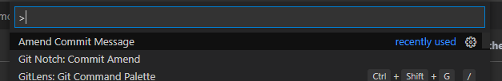
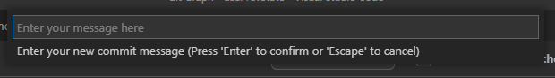

# Amend Commit Message

A simple extension for amending your last commit message

Simply select the `Amend Commit Message` command from the Command Palette and enter your new commit message

All this does under the hood is use `git commit --amend -m` to update your last message.